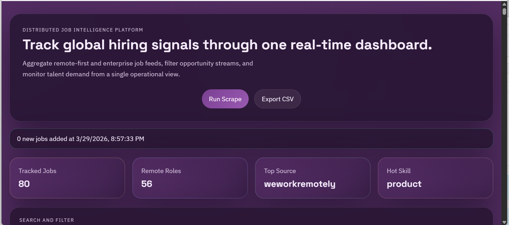
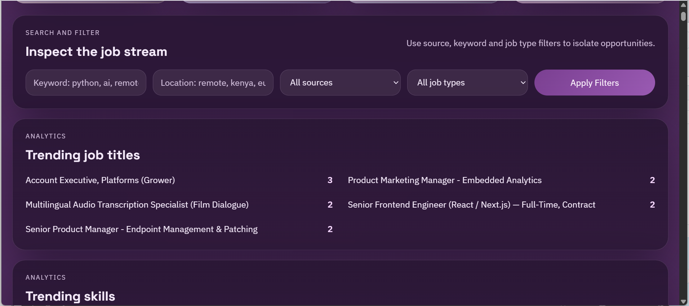
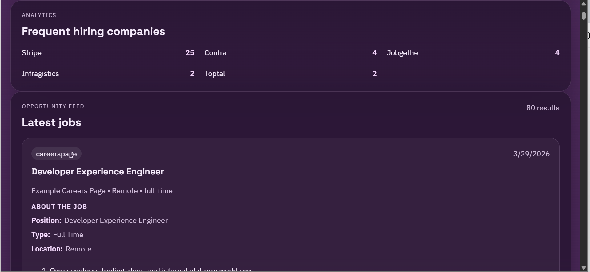

# Job Market Intelligence Scraper

A full-stack job aggregation and analytics platform that automatically collects, filters and analyzes job listings from multiple global and remote-first sources.

The system is designed to help developers, freelancers and recruiters discover opportunities faster, track hiring trends and eliminate manual job searching.

Built with a FastAPI backend and a React dashboard, the platform separates data extraction, API services and UI into independent layers for scalability and future SaaS expansion.

## Key Features

- Multi-source job aggregation (RemoteOK, WeWorkRemotely, African boards and extensible careers pages)
- Real-time scraping with manual trigger support
- Advanced filtering (keyword, location, job type, source)
- Deduplicated job storage and normalization
- Analytics dashboard for job trends and insights
- CSV export for external workflows

## What is included

- FastAPI backend with:
  - `GET /jobs`
  - `POST /scrape/run`
  - `GET /stats`
  - `GET /export/csv`
- Pluggable scraper architecture under `backend/app/scrapers`
- Deduplication based on job title, company and application URL hash
- JSON-backed persistence that can be swapped for PostgreSQL or MongoDB later
- React dashboard with:
  - keyword and location filtering
  - source and job type filtering
  - live scrape trigger
  - analytics cards and trend panels
  - CSV export

## Source coverage

Current MVP behavior:

- `RemoteOK`: active scraper using the public API with local fallback samples
- `WeWorkRemotely`: active scraper using RSS with local fallback samples
- `Greenhouse`: active scraper using public job board feeds configured by board token
- `Lever`: active scraper using public postings feeds configured by company slug
- `Ashby`: active scraper using public hosted job board endpoints configured by board slug
- `Careers Pages`: active scraper that extracts `JobPosting` JSON-LD from configured company, NGO and international-organization careers pages
- `MyJobMag`: active scraper with heuristic extraction for African market listings
- `BrighterMonday`: active scraper with heuristic extraction for East African listings
- `Corporate Staffing Services`: active scraper for Corporate Staffing company postings
- `Fuzu`: active scraper for marketplace-style African job listings

This keeps the architecture production-oriented while focusing on safer, more reliable job sources than high-risk platforms like LinkedIn or Indeed.

## Project structure

```text
backend/
  app/
    api/
    data/
    scrapers/
    services/
    main.py
  requirements.txt
frontend/
  src/
  package.json
```

## Backend setup

```bash
cd backend
python -m venv .venv
.venv\Scripts\activate
pip install -r requirements.txt
uvicorn app.main:app --reload
```

The API starts on `http://127.0.0.1:8000`.

`POST /scrape/run` is protected by API key auth, rate limiting, cooldowns, a single active scrape lock and scraper timeouts. For local development the default key is `local-dev-scrape-key`; change it with `JOBINTEL_SCRAPE_API_KEYS`.

## Frontend setup

```bash
cd frontend
npm install
npm run dev
```

The dashboard starts on `http://127.0.0.1:5173`.

To point the frontend at a different API URL, create `frontend/.env` from `frontend/.env.example`.

## Notes on persistence

Jobs are stored in `backend/app/data/jobs.json`. The storage service is isolated in `backend/app/services/job_store.py`, so moving to PostgreSQL or MongoDB is mostly a repository-layer change.

## Build Status

- Backend successfully compiled and validated
- Frontend production build completed

## Next plans

1. Replace JSON storage with PostgreSQL and add Alembic migrations.
2. Add APScheduler or Celery for recurring scrape jobs.
3. Introduce Playwright-based authenticated adapters where source terms allow it.
4. Add alert rules for email or webhook notifications.

## Why this project matters

Job seekers and recruiters often rely on multiple platforms to find relevant opportunities. This system centralizes job discovery into a single interface, reducing time spent searching and enabling data-driven insights into the job market.

Instead of manually browsing job boards, users get structured, searchable and exportable job data in real time.

## Project Positioning

This project is not just a scraper, but a modular job market intelligence system designed to evolve into a scalable SaaS platform for automated job discovery and analytics.

## 🖥️ UI Preview

### Main landing page & key insigths


### Filters for easier job search


### Retrieved jobs

